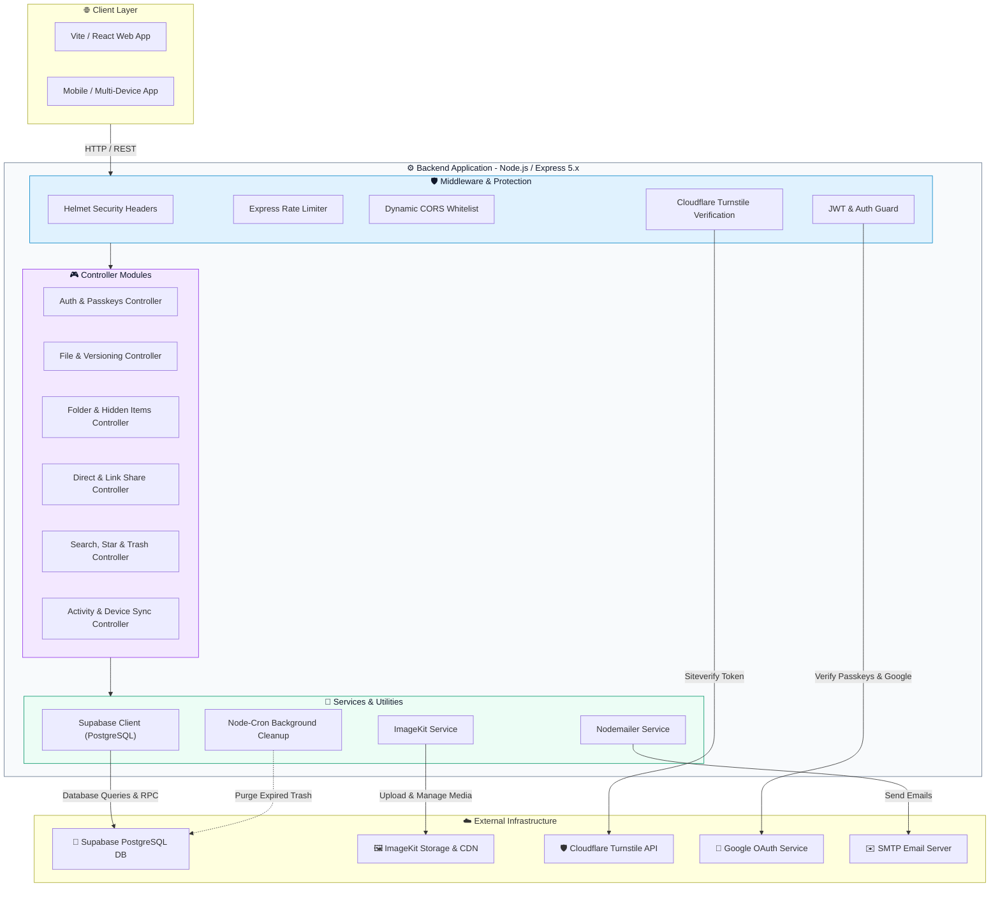

<div align="center">


# Cloud-Based Media Files Storage API

### Robust, Secure, and High-Performance Backend Infrastructure

<p align="center">
  
  
  
  
  
  
</p>

<p align="center">
  <a href="#-overview"><b>Overview</b></a> ·
  <a href="#-features"><b>Features</b></a> ·
  <a href="#-tech-stack"><b>Tech Stack</b></a> ·
  <a href="#-architecture"><b>Architecture</b></a> ·
  <a href="#-api-reference"><b>API Reference</b></a> ·
  <a href="#-installation--setup"><b>Quick Start</b></a>
</p>

<br/>

</div>

## 📋 Table of Contents

| | | |
|---|---|---|
| [✨ Overview](#-overview) | [🚀 Features](#-features) | [🛠️ Tech Stack](#-tech-stack) |
| [🏗️ Architecture](#-architecture) | [📂 Project Structure](#-project-structure) | [🔌 API Reference](#-api-reference) |
| [⚙️ Installation & Setup](#-installation--setup) | [🗄️ Database Migrations](#-database-migrations) | [🔐 Environment Variables](#-environment-variables) |
| [🤝 Contributing](#-contributing) | [📜 License](#-license) | [📞 Contact](#-contact) |

<br/>

## ✨ Overview

> **Cloud-Based Media Files Storage API** is an enterprise-grade backend service built to power next-generation cloud media storage, file management, and real-time collaboration platforms.

Engineered with **Node.js (v18+)** and **Express.js (v5.x)**, the API delivers secure data handling, multi-device synchronization, file version control, and granular sharing capabilities. It integrates seamlessly with **Supabase (PostgreSQL)** for transactional persistence, **ImageKit CDN** for on-the-fly media optimization, **WebAuthn / FIDO2 Passkeys** for passwordless biometric authentication, and **Cloudflare Turnstile** for anti-bot protection.

<br/>

## 🚀 Features

<table>
<tr>
<td width="33%" valign="top">

### 🔐 Security & Authentication
- **Passkeys (WebAuthn / FIDO2)**: Hardware security keys, Touch ID & Face ID authentication via `@simplewebauthn/server`
- **Google OAuth 2.0 & JWT**: Dual authentication flow with token-based session verification
- **Cloudflare Turnstile Protection**: Anti-bot challenge verification on registration, login & reset routes
- **Password Hashing**: Secure hashing with **Bcrypt** & secret recovery code generation
- **Defense in Depth**: Security headers via **Helmet**, dynamic **CORS** origin whitelisting, and strict **IP Rate Limiting** (200 req / 15 mins)

</td>
<td width="33%" valign="top">

### 📁 File & Media Management
- **ImageKit Storage & CDN**: Direct-to-cloud upload initialization, completion handlers, and real-time media transformations
- **File Versioning System**: Automatic version creation on file updates with one-click historical version restoration
- **Starred & Favorites**: Pin critical files and folders for instant access across devices
- **Trash & Soft-Delete**: Two-phase deletion lifecycle with soft-delete staging and recovery support
- **Hidden Items**: Specialized visibility controls for sensitive folders and items

</td>
<td width="33%" valign="top">

### 🤝 Sharing & Automation
- **Granular Direct Sharing**: User-to-user folder and file sharing with `viewer` or `editor` permissions
- **Public & Bundle Share Links**: Single item or multi-file bundle sharing with custom passwords and expiration dates
- **Device Sync & Logging**: Real-time multi-device sync status tracking and audit logging
- **Automated Cron Cleaning**: Scheduled daily background tasks via `node-cron` to purge 30-day expired trash
- **Transactional Mailer**: HTML email dispatch via `Nodemailer` for shares, email verification, and password resets

</td>
</tr>
</table>

<br/>

## 🛠️ Tech Stack

### Core Technologies

| Technology | Purpose | Version |
|---|---|---|
|  | Asynchronous Server Runtime | `^18.x` / `^20.x` |
|  | HTTP REST Web Framework | `^5.2.1` |
|  | PostgreSQL Database & Storage Engine | `^2.112.3` |

### Key Libraries & Packages

| Package | Category | Purpose |
|---|---|---|
| `@simplewebauthn/server` | Authentication | Passkey / WebAuthn FIDO2 registration and authentication verification |
| `google-auth-library` | Authentication | Google OAuth token verification and social authentication |
| `jsonwebtoken` & `bcryptjs` | Security | JWT authentication tokens, refresh verification, and password hashing |
| `helmet` & `express-rate-limit` | Security | Security headers, rate limiting (200 req / 15m), and anti-abuse safeguards |
| `imagekit` & `multer` | Media | CDN integration, file uploads, image transformations, and metadata parsing |
| `nodemailer` | Communication | Transactional HTML email dispatch (Verifications, Password Resets, Share Invites) |
| `node-cron` | Background Jobs | Daily automated cleanup of expired trash items (30+ days retention) |
| `cookie-parser` & `cors` | Middleware | Cookie handling and dynamic CORS origin validation |
| `socket.io` | Real-time | Real-time WebSocket event connections for instant user updates |

<br/>

## 🏗️ Architecture



<br/>

## 📂 Project Structure

```
Cloud-based-Media-Files-Storage-Backend/
├── 📁 src/
│   ├── 📁 config/              # Service clients & environment setup
│   │   ├── 📄 imagekit.js      # ImageKit client initialization
│   │   └── 📄 supabase.js      # Supabase database client setup
│   ├── 📁 controllers/         # Business logic & controller handlers
│   │   ├── 📄 auth.controller.js     # Auth, Passkeys, Google OAuth, Reset password
│   │   ├── 📄 core.controller.js     # Global Search, Favorites/Stars, Trash management
│   │   ├── 📄 files.controller.js    # File CRUD, upload init/complete, versioning, sync
│   │   ├── 📄 folders.controller.js  # Folder hierarchy, hidden items, folder copy
│   │   ├── 📄 links.controller.js    # Public single & bundle link sharing
│   │   ├── 📄 shares.controller.js   # Direct user-to-user resource sharing
│   │   ├── 📄 tracking.controller.js # File access tracking & device sync logs
│   │   └── 📄 users.controller.js    # User search & profile lookup
│   ├── 📁 db/
│   │   └── 📁 migrations/      # 13 Modular SQL migration scripts
│   ├── 📁 middlewares/         # Custom Express middlewares
│   │   ├── 📄 auth.middleware.js      # JWT verification & optional auth guards
│   │   └── 📄 turnstile.middleware.js # Cloudflare Turnstile anti-bot verification
│   ├── 📁 routes/              # Express API endpoint declarations
│   │   ├── 📄 auth.routes.js        # /api/auth routes
│   │   ├── 📄 core.routes.js        # /api search, stars, trash routes
│   │   ├── 📄 email.routes.js       # /api/email notification endpoints
│   │   ├── 📄 files.routes.js       # /api/files routes & versioning
│   │   ├── 📄 folders.routes.js     # /api/folders routes
│   │   ├── 📄 index.js              # Central route aggregator
│   │   ├── 📄 links.routes.js       # /api/link-shares public link endpoints
│   │   ├── 📄 shares.routes.js      # /api/shares direct sharing
│   │   ├── 📄 tracking.routes.js    # /api/tracking activity endpoints
│   │   └── 📄 users.routes.js       # /api/users endpoints
│   ├── 📁 utils/               # Helper utilities & background tasks
│   │   ├── 📄 caseConverter.js  # CamelCase / snake_case data mappers
│   │   ├── 📄 cronJobs.js       # Daily trash cleanup task scheduler
│   │   ├── 📄 email.js          # Nodemailer HTML templates & email dispatchers
│   │   ├── 📄 error.js          # Custom AppError & standard status codes
│   │   └── 📄 hiddenItems.js    # User hidden items resolution logic
│   └── 📄 server.js            # Main Express app initialization & server entry point
├── 📄 .env                     # Local environment configuration
├── 📄 .env.example             # Template for required environment variables
├── 📄 package.json             # Package scripts & dependencies
└── 📄 README.md                # Project documentation
```

<br/>

## 🔌 API Reference

### 🔑 Authentication (`/api/auth`)

| Method | Endpoint | Protection | Description |
|---|---|---|---|
| `POST` | `/api/auth/register` | Turnstile | Register new account with email & password |
| `GET` | `/api/auth/verify/:token` | Public | Verify email address using verification token |
| `POST` | `/api/auth/login` | Turnstile | Authenticate user & receive JWT token |
| `POST` | `/api/auth/google` | Public | Authenticate / Sign up via Google OAuth token |
| `POST` | `/api/auth/logout` | Public | Clear auth cookies & terminate session |
| `POST` | `/api/auth/forgot-password` | Turnstile | Trigger password reset email link |
| `POST` | `/api/auth/reset-password` | Turnstile | Set new password using token |
| `GET` | `/api/auth/passkeys/register-options` | JWT Protected | Generate WebAuthn registration challenge |
| `POST` | `/api/auth/passkeys/register-verify` | JWT Protected | Verify & register new WebAuthn passkey |
| `POST` | `/api/auth/passkeys/login-options` | Public | Generate WebAuthn login assertion challenge |
| `POST` | `/api/auth/passkeys/login-verify` | Public | Verify Passkey assertion & authenticate user |
| `POST` | `/api/auth/secret-code` | JWT Protected | Update user secret recovery code |
| `GET` | `/api/auth/me` | JWT Protected | Fetch authenticated user profile details |

### 📁 Files & Versioning (`/api/files`)

| Method | Endpoint | Protection | Description |
|---|---|---|---|
| `POST` | `/api/files/init` | JWT Protected | Initialize upload & get ImageKit authorization |
| `POST` | `/api/files/complete` | JWT Protected | Finalize file upload metadata in database |
| `GET` | `/api/files/recent` | JWT Protected | Retrieve recently accessed/uploaded files |
| `GET` | `/api/files/sync/status` | JWT Protected | Get device sync status |
| `POST` | `/api/files/sync/log` | JWT Protected | Log device synchronization event |
| `GET` | `/api/files/:id` | JWT Protected | Get single file metadata |
| `PATCH` | `/api/files/:id` | JWT Protected | Rename or move file to another folder |
| `DELETE` | `/api/files/:id` | JWT Protected | Soft-delete file (move to trash) |
| `POST` | `/api/files/:id/copy` | JWT Protected | Duplicate file to specified target folder |
| `GET` | `/api/files/:id/versions` | JWT Protected | Retrieve file version history |
| `POST` | `/api/files/:id/versions/restore` | JWT Protected | Restore file to a previous version |

### 📂 Folders & Navigation (`/api/folders`)

| Method | Endpoint | Protection | Description |
|---|---|---|---|
| `POST` | `/api/folders` | JWT Protected | Create a new folder |
| `GET` | `/api/folders/root` | JWT Protected | Fetch root directory contents (folders & files) |
| `GET` | `/api/folders/all` | JWT Protected | Get flat list of all user folders for tree navigation |
| `GET` | `/api/folders/hidden` | JWT Protected | Get hidden folders and items |
| `GET` | `/api/folders/:id` | JWT Protected | Fetch specific folder details & children |
| `PATCH` | `/api/folders/:id` | JWT Protected | Rename or move folder |
| `DELETE` | `/api/folders/:id` | JWT Protected | Soft-delete folder and nested contents |
| `POST` | `/api/folders/:id/copy` | JWT Protected | Deep copy folder hierarchy to destination |

### 🤝 Shares & Links (`/api/shares` & `/api/link-shares`)

| Method | Endpoint | Protection | Description |
|---|---|---|---|
| `POST` | `/api/shares` | JWT Protected | Share file/folder directly with user email |
| `GET` | `/api/shares/me` | JWT Protected | Get items shared with the current user |
| `GET` | `/api/shares/:resourceType/:resourceId` | JWT Protected | List all shares for a resource |
| `DELETE` | `/api/shares/:id` | JWT Protected | Revoke direct access share |
| `GET` | `/api/link-shares/:token` | Optional Auth | View public share link item (passcode optional) |
| `GET` | `/api/link-shares/bundle/:token` | Optional Auth | View public bundle share contents |
| `POST` | `/api/link-shares` | JWT Protected | Create public link for file/folder |
| `POST` | `/api/link-shares/bundle` | JWT Protected | Create multi-item bundle share link |
| `DELETE` | `/api/link-shares/:id` | JWT Protected | Delete/deactivate public share link |

### 🔍 Core Utilities (`/api`)

| Method | Endpoint | Protection | Description |
|---|---|---|---|
| `GET` | `/api/search` | JWT Protected | Global search across files & folders |
| `POST` | `/api/stars` | JWT Protected | Add file or folder to starred items |
| `DELETE` | `/api/stars` | JWT Protected | Remove item from starred list |
| `GET` | `/api/trash` | JWT Protected | Retrieve all items currently in trash |
| `POST` | `/api/trash/restore` | JWT Protected | Restore soft-deleted file or folder |
| `DELETE` | `/api/trash/:type/:id` | JWT Protected | Permanently purge item from trash & ImageKit |

<br/>

## ⚙️ Installation & Setup

### Prerequisites
- **Node.js** `v18.0.0` or higher
- **npm** `v9.0.0` or higher
- **Supabase Account** with PostgreSQL database instance
- **ImageKit Account** for media storage

### 🚀 Quick Start

**1. Clone the repository**
```bash
git clone https://github.com/ayanmanna123/Cloud-based-Media-Files-Storage-Backend.git
cd Cloud-based-Media-Files-Storage-Backend
```

**2. Configure Environment Variables**
```bash
cp .env.example .env
```
Update `.env` with your Supabase, ImageKit, Email, and Cloudflare credentials.

**3. Install Dependencies**
```bash
npm install
```

**4. Run Development Server**
```bash
npm run dev
```
The server will start at `http://localhost:5000` (or specified `PORT`).

<br/>

## 🗄️ Database Migrations

The database tables, stored procedures, and triggers are managed via SQL migration scripts located in `src/db/migrations/`:

| Migration | Purpose |
|---|---|
| `000_full_schema.sql` | Consolidated full schema definition |
| `001_create_users_table.sql` | User authentication & profile table |
| `002_create_folders_table.sql` | Folder hierarchy and parent mapping |
| `003_create_files_table.sql` | File records, URLs, mime-types, and sizes |
| `004_create_file_versions_table.sql` | Historical file versions tracking |
| `005_create_shares_table.sql` | User-to-user permission matrix |
| `006_create_link_shares_table.sql` | Public share links, passcodes & expiration |
| `007_create_stars_table.sql` | Starred / favorited items |
| `008_create_activities_table.sql` | User activity & event logs |
| `009_create_passkeys_table.sql` | WebAuthn passkey credentials & counter |
| `010_create_user_hidden_items_table.sql` | User hidden items mapping |
| `011_create_get_folder_share_role_function.sql` | Recursive folder share role SQL function |
| `012_create_device_sync_tables.sql` | Multi-device sync tracking & logs |

### Applying Migrations via Supabase CLI
```bash
# Login to Supabase CLI
npx supabase login

# Link your remote Supabase project
npx supabase link --project-ref <your-project-ref>

# Push migration scripts
npx supabase db push
```

<br/>

## 🔐 Environment Variables

| Variable | Required | Description | Example |
|---|---|---|---|
| `PORT` | No | Express server listener port | `5000` |
| `SUPABASE_URL` | **Yes** | Supabase project API URL | `https://xyz.supabase.co` |
| `SUPABASE_KEY` | **Yes** | Supabase service / anon API key | `eyJhbGci...` |
| `JWT_SECRET` | **Yes** | Secret key for JWT signing | `super_secret_jwt_key` |
| `IMAGEKIT_PUBLIC_KEY` | **Yes** | ImageKit public key | `public_xxx` |
| `IMAGEKIT_PRIVATE_KEY` | **Yes** | ImageKit private key | `private_xxx` |
| `IMAGEKIT_URL_ENDPOINT` | **Yes** | ImageKit endpoint URL | `https://ik.imagekit.io/your_id` |
| `EMAIL_HOST` | **Yes** | SMTP email host server | `smtp.gmail.com` |
| `EMAIL_PORT` | **Yes** | SMTP server port | `587` |
| `EMAIL_SECURE` | No | TLS security flag | `false` |
| `EMAIL_USER` | **Yes** | SMTP login email address | `user@gmail.com` |
| `EMAIL_PASS` | **Yes** | SMTP app password | `app_password` |
| `FRONTEND_URL` | **Yes** | Frontend application origin | `http://localhost:5173` |
| `TURNSTILE_SECRET_KEY` | Optional | Cloudflare Turnstile secret key | `1x0000...` |
| `TURNSTILE_ENABLED` | Optional | Enable/Disable Turnstile verification | `true` |

<br/>

## 🤝 Contributing

Contributions are welcome! Please follow these steps:

1. **Fork** the repository
2. **Create** your feature branch (`git checkout -b feature/amazing-feature`)
3. **Commit** your changes (`git commit -m "feat: Add amazing feature"`)
4. **Push** to the branch (`git push origin feature/amazing-feature`)
5. **Open** a Pull Request

<br/>

## 📜 License

Distributed under the **MIT License**. See `LICENSE` for more information.

<br/>

## 📞 Contact

<div align="center">

### Ayan Manna 👨‍💻

<p>
<a href="https://linkedin.com/in/ayanmanna"></a>
<a href="https://twitter.com/ayanmanna"></a>
<a href="https://github.com/ayanmanna123"></a>
</p>

<br/>

**Made with ❤️ by [Ayan Manna](https://github.com/ayanmanna123) and the open-source community**

</div>
